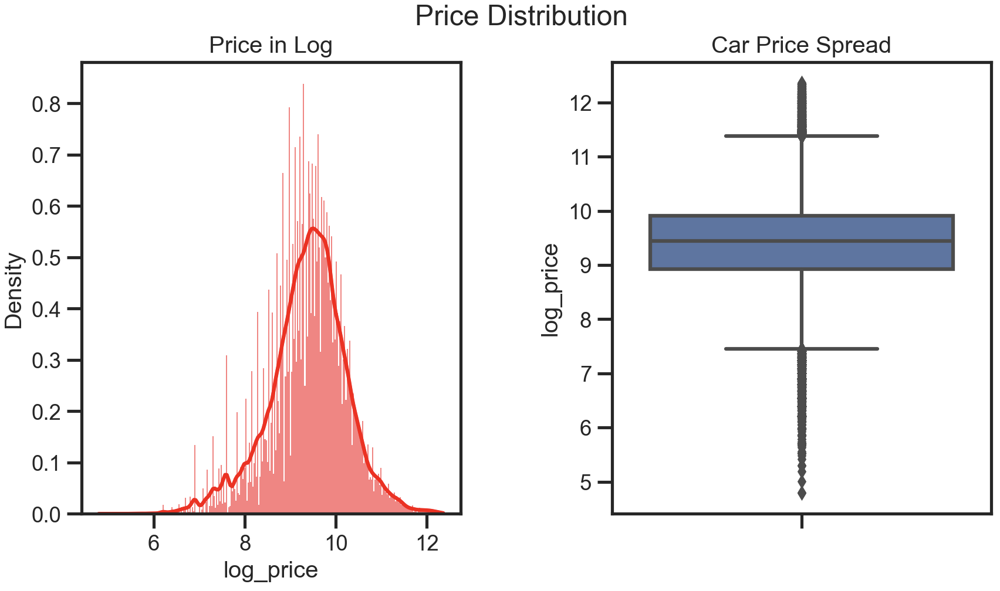
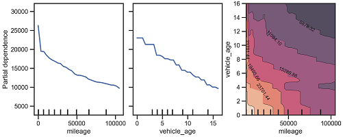

# Predicting car price using Regression models(Over 400k rows of data from AutoTrader)

## 📝 INTRODUCTION AND PROBLEM STATEMENT.    
Auto Trader is the largest digital automotive marketplace in the UK and Ireland, having served as the go-to destination for car buyers for the past 40 years. Its mission is to drive change together, responsibly, by expanding both car-buying and selling audiences, transforming the way cars are sold in the UK through the provision of the best online car-buying experience, and empowering all retailers to sell online. Auto Trader seeks to forge stronger partnerships with its customers, leverage its voice and influence to promote environmentally friendly vehicle choices.  

This project aims to utilize Machine Learning models to predict the price of a customer's car once it is listed on the website. The objective is to determine whether the price is overpriced, underpriced, or aligned with the current market price of the car.

## 🖇 🖥️  PREREQUISITES AND INSTALLATION.   
1. Install and Upgrade scikit :-
```bash
!pip install --upgrade scikit-learn -q --user
```
2. Install SHAP :-
```bash
!pip install -q shap
```
## ⏳ DATA SOURCES.   
The dataset is a Car Sale Adverts dataset provided by Auto Trader, one of Manchester Metropolitan University-industry partners. Dataset was only available as a student of MMU.

## 📑 MEANING AND TYPES OF FEATURES.   
- **public_reference**: The unique ID for each car advert.
- **mileage**: The total distance covered by the car to date.
- **reg_code**: This is the unique code for each year of registration.
- **standard_color**: The colour of the car.
- **standard_make**: The brand of the car.
- **standard_model**: The brand model of the car.
- **vehicle_condition**: The vehicle condition; either NEW or USED.
- **year_of_registration**: The first registration year of the car.
- **price**: The price of the car in pounds(£).
- **body_type**: The body type of the car i.e SUV, Saloon, Minibus, and so on.
- **crossover_car_and_van**: A crossover is a type of automobile with an increased ride height that is built on unibody chassis
construction shared with passenger cars, as opposed to traditional sport utility vehicles (SUV) which are built on a body-on-frame
chassis construction similar to pickup trucks.
- **fuel_type**: The type of fuel the car runs on.

## ANALYZING SOME UNIVARIATE DISTRIBUTION WITH PLOTS.   
"univariate" means that the analysis is focused on a single variable or feature. Plots are used to visualize the distribution of the variable, which can help in understanding its characteristics such as its central tendency, spread, skewness, and presence of outliers.I also have to log the price  because visualizing the logarithm of the prices using plots can help better understand the distribution and patterns in the data. 

- 💷 Analysis of Price Distribution
 
  

We can clearly see that the price has a normal distribution and the box plot at the right also shows we have some outliers as it shows from the whisker on the plot.

- 🧭 Analysis of Mileage Distribution

 
 
 The mileage from the mileage Distribution plot shows that the mileage is righly skewed, also the boxplot shows we have some outliers.
 
-  🚌 ⛽️ Analysis of Body type and Fuel Type
  
  
 Clearly it is shown here that we have more vehicles with Hatchback, followed by SUV. From the right plot we can see petrol vehicle are sold more than any other followed by the Diesel.

## ⏳ DATA PROCESSING.    
- #### 🚿 DEALING WITH NOISE, MISSING VALUES AND OUTLIERS 
    **Noise**   
The ’year of registration’ column shows some noise. The following values were observed to be written as ’year’: 999.0, 1006.0, 1007.0, 1008.0, 1009.0, 1010.0, 1015.0, 1016.0,1017.0, 1018.0, 1063.0, 1515.0, and 1909.0. These appear to be typos, as for instance 1006.0 should be 2006.0. I have corrected all such values. Similarly, the ’reg code’ column had some noise which was also corrected
          
   **Missing Values**  
The table below shows the columns with their corresponding number of missing values.   

| Column           | No of Missing Value |  
| -------------------|--------------------| 
| public reference   | 0                  | 
| mileage            | 127                | 
| reg code           | 31857              | 
| standard colour    | 5378               |
| standard make      | 0                  |
| standard model     | 0                  |
| vehicle condition  | 0                  |
| year of registration | 33311            |
| price              | 0                  |
| body type          | 837                |
| crossover car and van | 0               |
| fuel type          | 601                |
| log price          | 0                  |

As seen from the table, there are 6 columns with missing values. We will handle them one at a time.
First, the NEW cars have over 30,000 with no reg code. I decided to assign 0 as it means they are not yet registered. From the other missing reg codes, there are 608 USED cars. These were filled with their corresponding year of registration using the
[Vehicle Registration Plates of the United Kingdom](https://en.wikipedia.org/wiki/Vehicle_registration_plates_of_the_United_Kingdom).
Second, to fill the year of registration, I first dropped the reg codes with alphabets and those with year of registration as NaN (less than 30 of them). I did this because I only wanted to fill those with reg codes with numbers. Also, it is reasonable to drop those
because they are few and dropping them will not negatively affect the dataset. I filled the year of registration using the corresponding registration plate year. For example, if the reg code is 18, I filled the year with 2018 as seen in the Vehicle Registration Plates of the United Kingdom.
Third, the Mileage has some missing values. I filled the mileage by grouping the vehicles with their corresponding year of registration and filled each with the mean. For example, all vehicles with year of registration 2012 with missing mileage were filled with the mean of vehicles registered in the year 2012.
Fourth, the standard Color has 5344 missing values. I filled that by grouping the color by standard model and standard make and assigning the mode of the color to the missing values. After grouping and checking the unique values, I found out that there are a few vehicles that were given the color 0. This happened because they are just one particular make and model, and they do not have any color at all. I dropped those because they are not many.
Fifth, there were 581 missing fuel types.Filling the fuel type with the mode of fuel type, which is petrol, will not have a negative impact on our model.
The last part is filling for body type. We also grouped the body type by standard model and standard make and assigned the mode of the body type to the missing values. After this action, we observed that some values were given 0. This happened because they are just one particular make and model in the dataset, and they do not have any body type registered in the dataset. We observed that most of such vehicles are only one except for the Volkswagen Caddy, which has 12. I checked Google to see what type of body type it is, and I found out that it is a Wagon so I filled them with Wagon.


   **Outliers**  
It was observed that there are outliers in both the mileage and price columns. To handle these outliers, I used the quantile method. However, since there are new cars that should have 0 as mileage, there will not be a lower quantile. Therefore, I only removed the upper quantile for both mileage and price.
```bash
max_threshold  = autotrader['mileage'].quantile(0.99)
autotrader = autotrader[autotrader['mileage'] < max_threshold]
autotrader[autotrader['mileage']>140000.0]
```
Below is the box plot after outliers are removed


- #### 🛠 FEATURE ENGINEERING AND DATA TRANSFORMATION   

Feature engineering is the process of creating new features or modifying existing ones to improve the performance of a machine learning model. The first feature that was engineered was vehicle age, which was achieved by subtract-ing the year of registration from the current year. A current year column was also created using the datetime.now() module.
Secondly, a column called average mileage was created by using a journal published on-line titled Used Car Mileage Vs Age – Which Matters More?, According to government statistics, the average number of miles driven by cars in England each year was 7,400 miles in 2019. Therefore, each vehicle’s average mileage was calculated by multiplying its age with 7,400.
Lastly, the mileage was categorized into four groups. If the original mileage is between 0 and half of the average mileage, the vehicle is classified as having low mileage. If the mileage is less than or greater than half of the average mileage, it is classified as having
good mileage. If the mileage is 15,000 or more than the average mileage, it is classified as having high mileage. Otherwise, it is classified as having very high mileage.

## 🏽‍ METHODS.   
- #### 📥 FEATURE SELECTION AND DATA SAMPLING.   

Feature selection is the process of selecting a subset of relevant features or variables from a larger set of features in order to improve the performance of a machine learning model. The goal is to reduce the dimensionality of the input space while retaining as
much of the original information as possible. 
Before selectiong the features, There are some features that are naturally not relevant for the model, I will drop those once before I do automatic feature selection.
```bash
autotrader_sampled = autotrader_sampled.drop(columns=['public_reference', 'reg_code','log_price','current_year' ])
```

Also note that I reduced the sample size to 20% using the sample module so as to increase computational time.
```bash
autotrader_sampled = autotrader.sample(frac=0.20, random_state=82)
```

There are several method for feature selection like SelectKbest, Recursive Feature Elimination (RFE) and many more but I decided to use SelectKbest.Using SelectKBest requires specifying a value k to determine the best k. To accomplish this, the technique of cross-validation was employed. A linear regression model was trained with varying numbers of selected features using SelectKBest. A 10-fold cross-validation was then performed to estimate the mean squared error. The negative mean squared error was used as a scoring metric because cross val score tries to maximize the score. The mean squared error was plotted as a function of k, and the value of k
that resulted in the lowest error was selected. The optimal value of k was determined to be 10. Thereafter we fitted X and y with k = 10 and I am left with 10 features, It was also noticed that year of registration and vehicle age were
given similar information so one of it was dropped. The plot below shows the best k.


- #### 🪚 DIMENSIONALITY REDUCTION USING PCA.   
  
After reducing the number of columns to 9, I further reduced the dimensionality of the data using a technique called PCA. First, I encoded the columns using two encoded methods **one-hot encoding** for columns with no more than 4 categories and **target encoding** for columns with over 4 categories. After encoding, I have 13 columns. To determine the number of components to use in PCA, I employed the elbow method. This involved plotting the explained variance ratio as a function of the number of components and looking for the point where the curve starts to level off or plateau. Based on this method, we selected 8 components, reducing the dimensionality of our data from 13 to 8.
 
 
 
It is also important that I see how the features are used in each component of my PCA,a component heatmap was also plotted as shown in the plot below.


As seen in plot above, the impact of feature on each component are shown, standard make and standard model are showing a positive impact on component 2, also fuel type is showing a positive high impact on component 6


- #### 🏘 MODEL BUILDING.     
  - A Linear Model.   

I choose polynomial regression as my linear model, I employed both PolynomialFeatures and Ridge. The former was responsible for generating polynomial features of the input variables, while the latter is a regularized linear regression algorithm that was used to
fit the model.
To perform a grid search over a set of hyperparameters for the model, I used the GridSearchCV object. The hyperparameters that were varied included the regularization strength (alpha) and the degree of the polynomial features. The metric used to evaluate the performance of the model was the negative root mean squared error (neg root mean squared error).
The best hyperparameters found during the grid search were then used to fit the final model, which was used to generate predictions on a held-out test set. The performance of the model was evaluated using several metrics, including the mean absolute error (MAE), mean squared error (MSE), root mean squared error (RMSE), and R-squared. The results of the model are shown in the table below:

| MAE     | MSE     |  RMSE  |  R-squared(%)|       
| --------|-------- |--------|--------| 
| 3128    |34475784  | 5872  |   87     | 


  - A Random Forest.   

I used RandomForestRegressor for my second model, GridSearchCV was used to optimize the hyperparameters. GridSearchCV is used with a dictionary of hyperparameters (param grid rfr) to find the best combination of max depth and n estimators. The scoring parameter is set to ’neg root mean squared error’ to evaluate the model. cv is set to 5, which means cross-validation with 5 folds is performed. The best hyperparameters found during the grid search were then used to fit the final model, which was used to generate predictions on a held-out test set. It then evaluates the performance of the model by computing several metrics such as mean absolute error (MAE), mean squared error (MSE), root mean squared error (RMSE), and R-squared. Finally, it prints out the values of these metrics. The results of the model are shown in the table below: 
 
  | MAE     | MSE     |  RMSE  |  R-squared(%)|       
| --------|-------- |--------|--------| 
| 4267    |46578171  | 6825  |   82     | 

  - A Boosted Tree.  

Just like the other model, Grid Search Cross-Validation was also performed on the Gradient Boosting Regressor which is the third model, I used param grid gb dictionary to specify the different hyperparameters to be tuned. The n estimators parameter determines the number of trees in the ensemble, while learning rate controls the contribution of each tree. The max depth parameter limits the depth of each tree to avoid overfitting. Cross validation of 5, n jobs of 1 and verbose of 2 was also used. Same metrics was also used and the result is shown in table below:

| MAE     | MSE     |  RMSE  |  R-squared(%)|       
| --------|-------- |--------|--------| 
| 2974    |29108125  | 5395  |   89     | 


  - An Averager/Voter/Stacker Ensemble.    

The last model used is the ensemble model, The ensemble model combines the predictions of three other models: a polynomial regression model (poly2 model), a random forest model (rf model), and a gradient boosting model (gb model). I trained each of these models on a training set of input features (X train) and output values (y train). The poly2 model uses polynomial features (via the
PolynomialFeatures transformer) and ridge regression, while the rf model and gb model use random forest and gradient boosting regression techniques, respectively.  
After each model is trained, they are combined using a voting regressor (VotingRegressor), which takes the average of each model’s predicted values. This ensemble model is then trained on the same training set. Finally, the code evaluates the ensemble model’s
performance on a test set of input features (X test) and output values (y test). And I used the metrics I used for other model for it too. The result is shown in table


| MAE     | MSE     |  RMSE  |  R-squared(%)|       
| --------|-------- |--------|--------| 
| 3165    |31778377  | 5637  |   89     | 

- Model Summary/Conclusion. 

| Models          | MAE                 | MSE               | RMSE              | R-squared(%)         |
|-------------------|---------------------|-------------------|-------------------|----------------------|
| Polynomial        | 3128                | 34475784          | 5872              | 87                   |
| Random Forest     | 4267                | 46578171          | 6825              | 82                   |
| Gradient Boosting | **2974**            | **29108125**         |**5395**             | **89**                |
| Ensemble/Voting   | 3165                | 31778377          | 5637              | **89**                |


**Mean Absolute Error (MAE)** : A lower MAE is better as it indicates that the model’s predictions are closer to the true values. The gradient boosting model has the lowest MAE of 2974. 

**Root Mean Squared Error (RMSE)**: This is the square root of the average of the squared differences between the model’s predictions and the true values. It is calculated by taking the square root of the Mean Squared Error (MSE). The RMSE is also in the same unit as the target variable, in this case, the price of the car in pounds. The gradient boosting model has the best RMSE.    

**R-squared**: As we can see from table above, both the gradient boosting and ensemble models have the same R-squared value of 89%. This indicates that both models are able to explain 89% of the variance in the target variable.  

In conclusion Gradient boosting performs best.


- #### 📊 MODEL EVALUATION AND ANALYSIS.   
  - Overall Performance with Cross-Validation.  
 
I performed cross-validation on four regression models and printed the mean and standard deviation of the negative root mean squared error (RMSE) score for each model.

| Models          | Mean                 | Standard Deviation               
|-------------------|---------------------|-------------------|
| Polynomial        | 6220                | 249          | 
| Random Forest     | 7289                | 265          |
| Gradient Boosting | **5980**            | **223**      |
| Ensemble/Voting   | 6136                | 240          | 

Since lower RMSE values indicate better performance, we can conclude that the Gradient Boosting regression model has the best performance, followed by the Ensemble regression model, Polynomial regression model, and Random Forest regression model, Also the standard deviation of the RMSE scores is also provided, which gives an idea of the variability of the model’s performance across the five cross-validation folds. Generally, a lower standard deviation indicates that the model is more stable and consistent in its performance. Based on the standard deviation values, the gradient boosting model appears to be the most stable


  - True vs Predicted Analysis.   

I decided to obtain predictions of y using the best model, which is gradient boosting. I also calculated the difference between the true price and the predicted price, took the absolute value, and found the mean of the differences. Additionally, I plotted a graph of predicted price against true price, as seen in the plot below:


Ideally, all points should be close to a regressed diagonal line shown in the above plot. So,if the Actual is 5, predicted should be reasonably close to 5. For perfect prediction, Predicted=Actual, The graph shows the model predicted well for vehicle that are below
100,000 thousand pounds, but there is deviation for vehicle above that price.

  - Global and Local Explanations with SHAP   

SHAP (SHapley Additive exPlanations) is a method for explaining the output of any machine learning model by assigning feature importance scores to each input feature. To analyse SHAP I did a quick HistGradient Boosting Regressor, This is because I used PCA for my model and this makes my model lost its explanabilit. the SHAP plot is shown below:


The sharp summary plot combines feature importance with feature effects. Each point on the summary plot is a Shapley value of an instance per feature. The position on the y-axis is determined by the feature and on the x-axis by the Shapley value of each
instance. The combined feature standard model and standard make are the most important feature as they have a high Shapley value. The color represents the value of the feature from low to high. Overlapping points are jittered in the y-axis direction, so we get a sense of the distribution of the Shapley values per feature. The features are ordered according to their importance which mean standard model is the most important feature. It can also be deduce that vehicle age and mileage affects the price both negatively and positively.


  - Partial Dependency Plots.   

PDP stands for Partial Dependence Plot. It is a popular technique for visualizing the relationship between a set of input features and the output of a machine learning model. The plot below shows two seperate input features and also shows interaction between
the two features.



From above plot, the left plot shows the relationship between mileage and vehicle price. It indicates that an increase in mileage leads to a decrease in vehicle price.
Similarly, the middle plot reveals that vehicle age also has a negative correlation with price. The higher the mileage and the age of the vehicle, the lower the price. This trend is further confirmed in the interaction plot that depicts vehicle age and mileage against price. The initial price was at 23701, but as both the age of the vehicle and mileage increase, the price decreases significantly, eventually reaching 6878.

## 📝 CONCLUSION
Approximately 90% of R-squared and an MAE of 2974 is considered relatively good, but there is potential for improvement by either conducting further feature engineering or increasing the parameter settings during grid search to achieve better results. However, due to limited computational resources and time constraints, these additional optimizations could not be performed.

##  📖 Acknowledgments
I want to use this medium to appreciate my great tutor. https://github.com/gerberl

## Contact information

LinkedIn:    https://www.linkedin.com/in/ope-yemi-adeniyi-b8bb3186/           
Email:       Adeniyiopeyemi25@yahoo.com

# 🏃 🚶 💃
